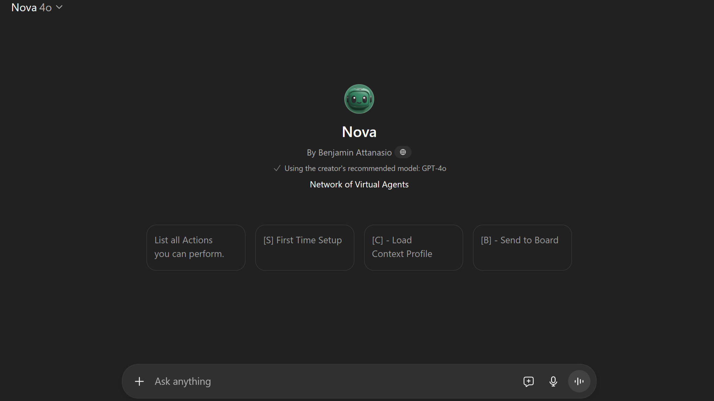
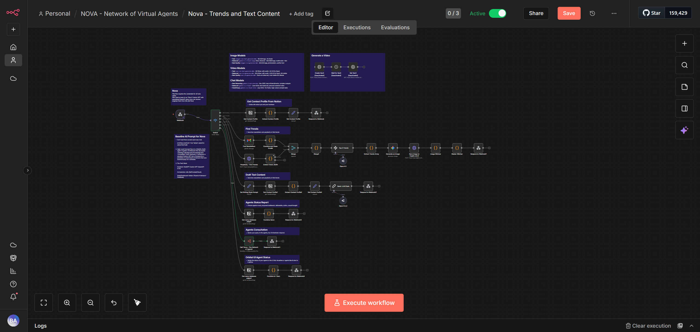

# Nova

Nova shows a roster of AI agents as stars orbiting a centre. Click one and the
camera flies to it, and you get that agent's status, current thoughts, and what
it's focused on. It runs as a kiosk on a Raspberry Pi 5 with a touchscreen, and
it works the same in any browser.


It's one HTML file with Three.js from a CDN. There's no build step, no framework,
and no bundler.

## Running it

```bash
cp config.template.js config.js
python3 -m http.server 3000
```

Then open http://localhost:3000.

`config.js` is gitignored, and it holds two n8n webhook URLs:

| Key | What it's for |
|---|---|
| `WEBHOOK_FETCH_URL` | Returns every agent, read from Notion |
| `WEBHOOK_UPDATE_URL` | Writes agent updates back. Optional |
| `REFRESH_INTERVAL` | Milliseconds between refreshes. 0 disables polling |

The front end knows nothing about Notion. It asks a webhook for a list of agents
and draws it, so swapping Notion for a database or a flat JSON file means
changing the n8n flow and nothing here.




## Running it as a kiosk

Built for a Raspberry Pi 5 with a DSI touchscreen at 1280x800.

```bash
sudo apt update
sudo apt install chromium git -y
git clone <your-fork> ~/nova
cd ~/nova
cp config.template.js config.js    # then paste your webhook URL in
```

`start_kiosk.sh` serves the directory and launches Chromium in kiosk mode:

```bash
#!/bin/bash
exec > /home/pi/nova/kiosk.log 2>&1
echo "--- Boot Run: $(date) ---"
cd /home/pi/nova

# generate a config on first boot so a fresh clone still starts
if [ ! -f "config.js" ]; then
    cp config.template.js config.js
fi

python3 -m http.server 3000 &
sleep 5

chromium \
  --kiosk \
  --noerrdialogs \
  --enable-gpu-rasterization \
  --ignore-gpu-blocklist \
  http://localhost:3000/index.html
```

`chmod +x start_kiosk.sh`, then autostart it with
`~/.config/autostart/nova.desktop`:

```ini
[Desktop Entry]
Type=Application
Name=NOVA Kiosk
Exec=/bin/bash /home/pi/nova/start_kiosk.sh
StartupNotify=false
Terminal=false
```

The `sleep 5` before Chromium starts is doing real work. Without it the browser
races the Python server and you get a blank kiosk with no error on screen, on a
device with no keyboard attached to go and investigate with.

`--ignore-gpu-blocklist` and `--enable-gpu-rasterization` matter too. The Pi 5's
VideoCore VII is fine at this, and Chromium blocklists it by default, which
drops you to software rendering and a starfield that runs at about 4fps.

## Layout

```
index.html            the whole thing: Three.js scene, UI, webhook client
config.template.js    copy to config.js and fill in
assets/               previews and the avatar
ui_ideas/             alternate interfaces that were tried and not shipped
ai_context/           design notes and the platform architecture
vercel.json
```

`ui_ideas/` has a pixel-art version, a neural-network layout, a totem, and a
Pokemon-styled one. None of them shipped. They're kept because the starfield only
looks obvious in hindsight.

## Limitations

- The agent data is whatever your webhook returns. There's no backend here.
- WebGL, so it needs a GPU that can rasterise a few hundred sprites. A Pi 4
  manages it and it's not pleasant.
- Three.js r128 from a CDN, so there's no offline mode.
- Kiosk instructions are Raspberry Pi OS specific. The page itself runs anywhere.

## License

MIT. See [LICENSE](LICENSE).

More at [benattanasio.com/lab](https://benattanasio.com/lab).
